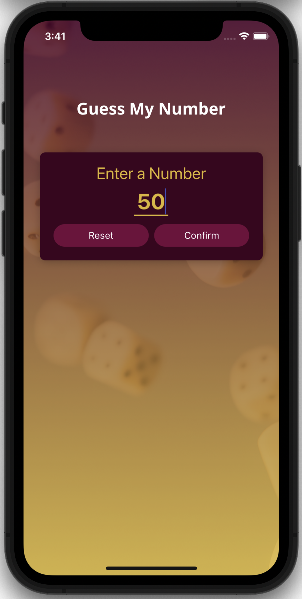
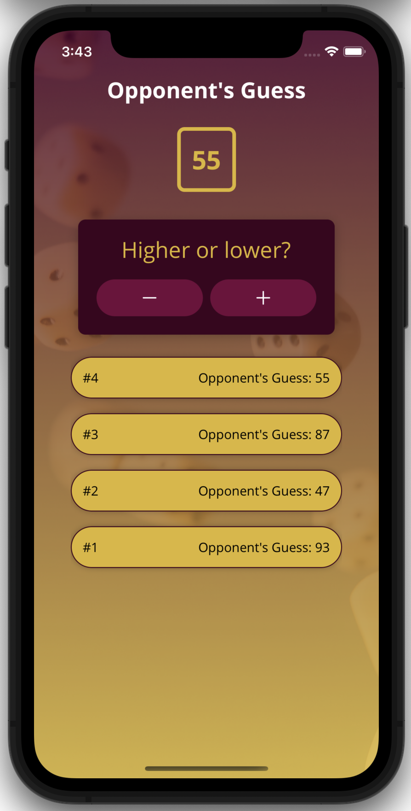
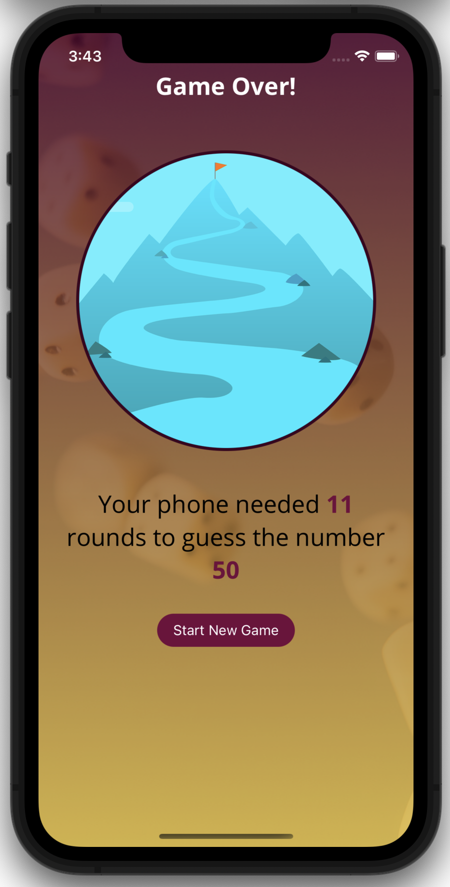

# RNGuessingGame - React Native

# Acknowledgement

This mobile application was built while I was learning React Native through the course "React Native - The Practical Guide [2024]" by Maximilian Schwarzmüller.
The link to the course can be found [here](https://www.udemy.com/course/react-native-the-practical-guide/?couponCode=CMCPSALE24#instructor-2).

# Description

A single-player mobile game where the player picks a number and has the computer guess the number.

# Screenshots

# How to open this app

1. Clone this repository
2. Open an iOS simulator using Xcode or Android simulator using Android Studio
3. Inside the root directory of this repo, run `npm i`
4. Then, run `npm start`
5. Lastly, press `a` for Android or `i` for iOS
